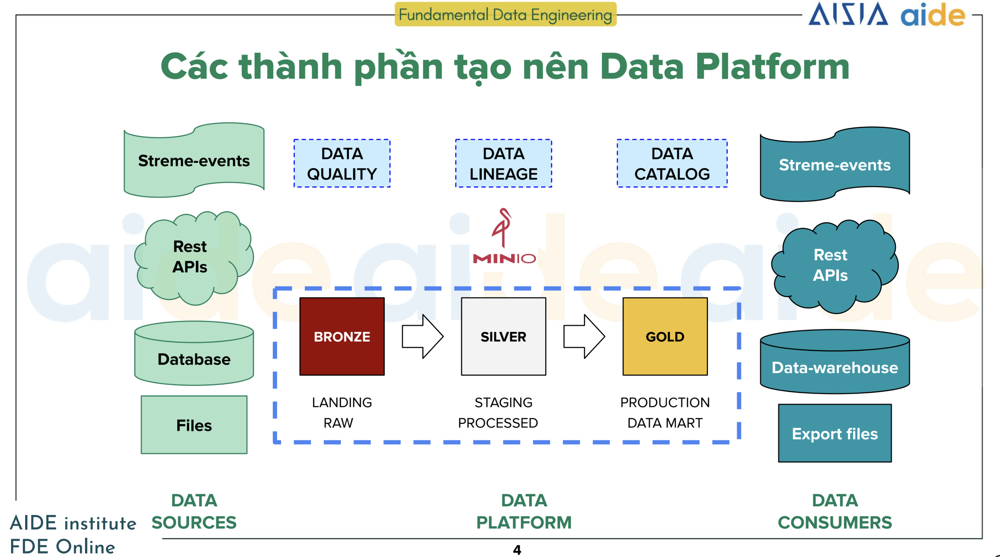
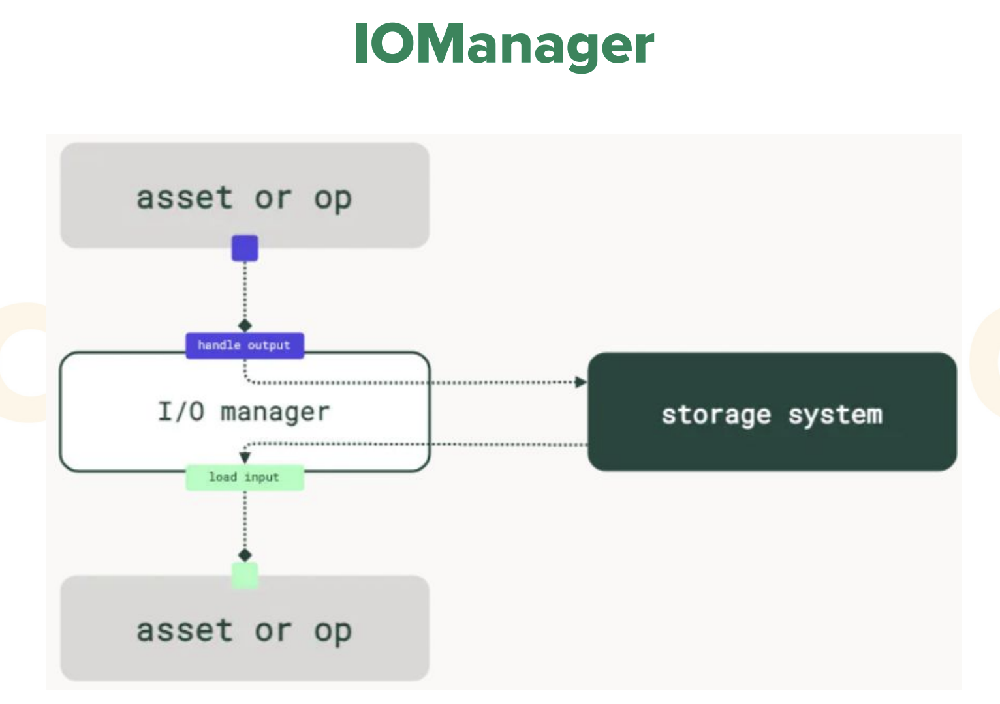

# [Week 2](https://classroom.google.com/c/NzE2MDIxNDIyMjQx/m/NzM1NjU4ODg0NzY2/details)

## Tổng quan về Data Pipelines
Data platform (hệ thống dữ liệu) bao gồm: architecture, infra, data quality, data lineage, data catalog, data pipeline

### Các thành phần tạo nên Data Platform
#### Bronze layer
Là nơi lưu trữ dữ liệu thô sau khi ingesting từ các data sources, **KHÔNG CÓ** bất kỳ chỉnh sửa hay data quality checks.

Dữ liệu thô ingest về thì cứ lưu đi, để back-up lại:
- Dữ liệu mất thời gian để ingest
- Dữ liệu trên source có thể bị xoá
- Dữ liệu mất tiền để mua


#### Silver layer
Là nơi dữ liệu được làm sạch, chuẩn hoá và trải qua data quality check để đảm bảo tin cậy trước khi sử dụng. Dữ liệu trên Silver layer **KHÔNG ĐƯỢC AGGREGATE**.

**Kinh nghiệm**: Trong quá trình làm việc với dữ liệu, phải nói chuyện trực tiếp với bên cung cấp dữ liệu để có những mô tả về dữ liệu, hiểu về dữ liệu như: dữ liệu được tạo ra ntn? ý nghĩa của từng field? ... Để biết được cách tối ưu xử lý dữ liệu.

#### Gold layer
Dữ liệu được aggregate, mang tính busines focus. Thường dùng để lập báo cáo KPIs hay tính toán chuyên biệt như feature engineering.

**Kinh nghiệm**: Cần làm việc với bên data consumers (DA, Data scientist, ...) để hiểu được strategy dùng cho tổng hợp và tính toán: Cần dùng những thông tin gì để aggregate ra những thông tin hữu ích cho Data Analysis, làm thể nào extract features cho Data scientist sử dung để train model.

## Các chiến lược EL dữ liệu
Đối với các data sources khác nhau thì mình sẽ có những chiến lược ingestion khác nhau.

### Ingestion layer
#### Batch data
Ingesting vast amount of data at one and at scheduled intervals
- Relational databases
- Files (CSV, JSON, Avro, Parquet, ...)
- SaaS APIs (JSON)

#### Stream data
Ingesting data constantly in real-time as it arrives.
- CDC, clickstream, page view events, ...
- IoT (JSON, Avro, bytes)

### Ingestion data strategy from RDBMSs
#### Full load ingestion pipeline
```sql
SELECT * FROM table
```
2 types of load:
- Append
- Overwrite

Full load ingestion is time-consuming, heavy workload and heavy resource consumption, it can leads to dead-lock (when 2 write and read transactions happens simultaneously on the same record) and crash the application.

Nên dùng incremental ingestion thay vì full load ingestion để giảm gánh nặng cho hệ thống database. Chỉ sử dụng khi không thể incremental, và dùng vào lúc lowest traffic (thường vào ban đêm)
#### Incremental ingestion
Chỉ ingest dữ liệu mới hoặc bị thay đổi so với lần cuối được ingest.
- Initial dump: dump dữ liệu từ trước tới giờ (chỉ làm 1 lần)
- Dựa vào **Data and time** khi record được inserted vào DB
```sql
-- Cách 1
SELECT * FROM table WHERE updated_at > (SELECT MAX(updated_at) FROM table)

-- Cách 2: có thể dùng để back-fill dữ liệu vào những ngày bị missing data do lỗi trong quá trình chạy data pipeline
SELECT * FROM table WHERE updated_at = "2019-05-01" (partition by date)
```
- Dựa vào **incremental IDs**
```sql
SELECT * FROM table WHERE id > 1000123
```

Incremental ingestion sẽ bị miss những dữ liệu bị xoá.

### Change data capture (CDC)
Batch ingestion cho dù là incremental hay full load thì đều bị nhược điểm là không track được dữ liệu bị delete hay lưu được sự thay đổi của dữ liệu. Ví dụ:
- Full load (append) chạy hourly cho dù track được sự thay đổi từ B -> B2, nhưng trong 1 tiếng đó B -> B3 -> D -> E -> B2 thì không track được. Nếu tăng tốc độ ingest data lên 5" hay 1" một lần, thì sẽ tạo ra stress workload trên database, gây ra deadlock

Change Data Capture (CDC) lưu toàn bộ transaction của database phục vụ cho nhiều mục đích khác nhau:
- Replicate database ở nơi khác, làm việc trên replica database này giảm workload lên primary database.

CDC + Message queue (Debezium + Kafka)

Khi nào nên dùng CDC:
- Giúp dữ liệu nguồn và đích `in-sync` với nhau real-time.
- Sử dụng event-driven giữa các micro-services

Nên kết hợp giữa Batch và CDC để phòng trường hợp mismatch giữa source và target ở thời điểm nào đó.

### Ingesting data từ files

### Ingesting data từ SaaS
Không để truy xuất trực tiếp từ database, nên độ linh động trong các strategy ingestion cũng thấp hơn database: third-party không hỗ trợ incremental ingestion, chỉ cho trích xuất những trường thông tin cố định, rate limit, ...

### Decision making
## Cài đặt ETL data pipeline với Dagster
### Tại sao cần orchestration
- Cần có data pipeline visualization, DAGs là một ví dụ thường xuyên thấy.
- Scheduling and Workflow Management: Giúp quản lý hiệu quả lượng lớn pipeline.
- Error Handling and Retry Mechanisms
- Monitoring and Logging

### Job/Op khó trả lời những câu hỏi quan trọng
Airflow hướng job/operation, Dagster hướng về asset

Job/Op khó trả lời những câu hỏi về Data. Ví dụ:
- Data có up-to-date?
- Cần làm gì để refresh data?
- Code sinh ra data này là gì?
- Khi update một data thì những data nào cần được update?

### Tại sao chọn Dagster
*Tham khảo slide*

### IOManager


IOManager xử lý output của upstream `assert or op` và input của downstream `assert or op` bằng cách lưu vào và lấy data ra từ `storage system`.

Storage system mặc định là `Filesystem IOManager`: dump object thành file picke hoặc load pickle file thành downstream data.

Khi pipelie có 100 tasks mà bị fail ở task thứ 100, chỉ cần retry lại task thứ 100. Vì đã lưu data của bước thứ 99 rồi.

Có thể khai bào `CSVIOManager` kế thừa từ `IOManger` và override lại `handle_ouput()` và `load_input()`

### Demo

#### @asset
- Truyền vào `config schema` giúp truyền vào thông tin lúc runtime, ứng dụng trong việc switching giữa các môi trường: dev, test, production thay vì hard-code
- `key_prefix` giúp cấu trúc các assets. Với `key_prefix=['fde', 'demo']` thì `asset_demo` sẽ nằm trong `fde/demo/asset_demo`
- `metadata` giúp lưu lại những thông tin liên qua của assets giúp làm việc dễ hơn: ai là người tạo ra assets (owner), mức độ ưu tiên, ...
- `compute kind` giúp annotate asset. Ví dụ asset này đang dùng python để xử lý.
- `group_name` gom nhóm các assets với nhau.
- `io_manager_key` giúp chọn custom IOManager thay vì dùng IOManager mặc định.
- `ins` nhận về nhiều input cho một asset.

#### Definition
Một class của dagster giúp mình định nghĩa data pipeline gồm có những gì: assets, IOManager
