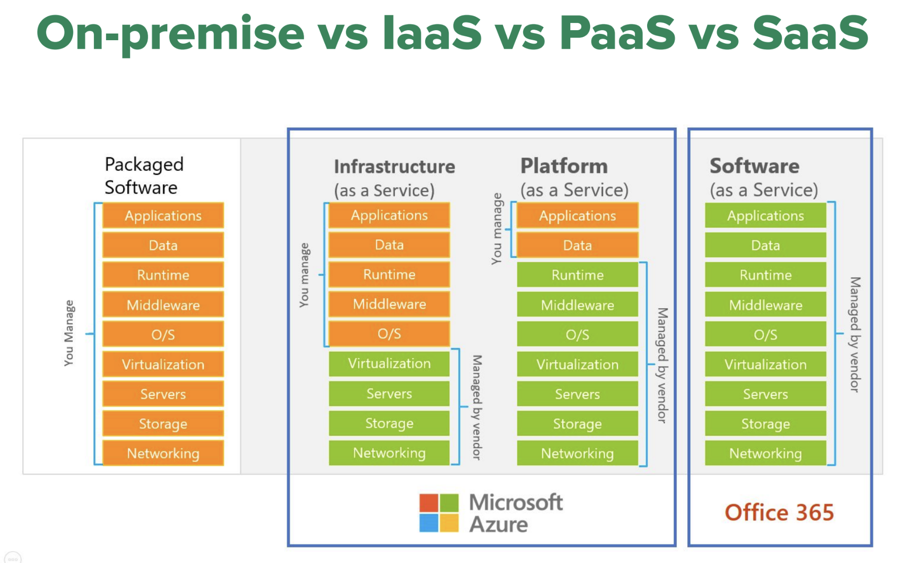

# [Week 3](https://classroom.google.com/c/NzE2MDIxNDIyMjQx/m/NzM1NjYwNjk4NTAw/details)

## Cloud computing

### On-premise vs IaaS, PaaS, SaaS

#### On-premise

Doanh nghiệp lớn thường chọn giải pháp này. Ví dụ: ngân hàng

Pros:

- Sử dụng lâu dài
- Tự mình quản lý được dữ liệu và tất cả mọi thứ liên quan

Cons:

- Chi phí đầu tư ban đầu, cơ sở hạ tầng và nguồn lực con người lớn để vận hành một data center
- Giải quyết sự cố: thiên tai, hoa hoạn, ...

#### IaaS

#### PaaS

Các start-up thường chọn giải pháp này để đưa sản phẩm ra thị trường càng nhanh càng tốt, cũng như giảm bớt nguồn lực để maintain infra.

#### SaaS

### Giới thiệu AWS, Azure, Google cloud

### Ingestion, Storage, Processing, Serving services

## Dagster
### Scheduling
#### Cron job là gì?
#### Dagster schedule
Dagster chỉ schedule được cho job không phải Asset. Dùng hàm `define_asset_job` để chuyển một asset thành job để chạy scheduling.

Cần set `timezone` cho schedule vì  khi chạy trên cloud giờ có thể bị sai lệch giữa các múi giờ.

#### Dagster schedule cho partition
Khi schedule cho `DailyPartitions` thì Dagster sẽ tự động chạy mỗi ngày thay vì phải define `cron_schedule`.
#### Backfill
### Partitioning
### Dockerized Dagster
Thay vì chạy `dagster dev` khi triển khai dagster cần chạy 3 services: dagit, deamon và grpc api
