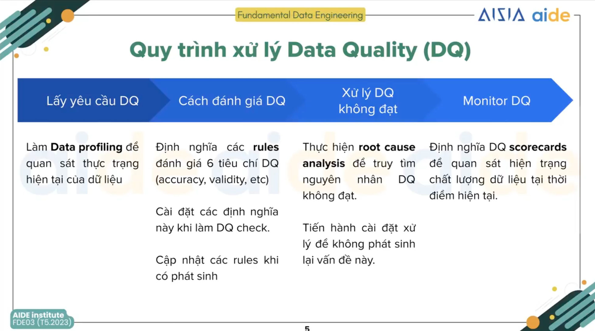

# [Week 4](https://classroom.google.com/c/NzE2MDIxNDIyMjQx/m/NzM1NjYxMzg0NjAw/details)

## Data platform: data quality, data lineage, data catalog
### Data quality
6 tiêu chí đánh giá:
- Accuracy
- Validity
- Timeliness
- Completeness
- Uniqueness
- Consistency
#### Quy trình xử lý Data Quality (DQ)

##### Lấy yêu cầu DQ
Làm việc trực tiếp với stakeholder, những người sinh ra dữ liệu để hiểu về dữ liệu và các thông tin cần thiết về dữ liệu. Cũng như, nắm được chất lượng dữ liệu, thực trạng hiện tại của dữ liệu.
##### Cách đánh giá DQ
Sự thống nhất về cách đánh giá DQ để dữ liệu phù hợp với những yêu cầu đặt ra nhằm phục vụ cho mục tiêu cuối.

Mỗi phòng ban có những định nghĩa khác nhau về DQ
##### Xử lý DQ không đạt
##### Monitor DQ
#### Công cụ testing chất lượng dữ liệu
- dbt test
- great_expectation

### Data lineage
### Data catalog
## DBT
### Đặt vấn đề
Làm việc với excel khá dễ dàng, nhanh gọn, ai cũng biết sử dụng. Tuy nhiên, khi dữ liệu có mối quan hệ phức tạp hơn và dữ liệu lớn hơn thì excel không thể đáp ứng được:
- Có thể nạp 100GB dữ liệu vào RAM?
- Mất bao lâu để gom nhiều data sources một cách thủ công?
- Tableau, Power BI bị treo mỗi lần kết bảng?
- Tháng nào cũng lặp lại công việc này?
=> DA cần DE hỗ trợ transform dữ liệu.

### dbt and the modern BI stack (3 steps)
[bi stack](../assets/bi_stack.png)
- Step 1: develop model. Viết business logic bằng SQL files đơn giản
- Step 2: compile project.  dbt suy diễn các dependencies trong data models và build DAG
- Step 3: build tables + views. Khi chạy dbt, business logic sẽ build dưới dạng tables hoặc views trong data warehouse. Computation workloads (aggregate, tạo table, tạo view, ...) sẽ được thực thi, diễn ra trên data warehouse.
