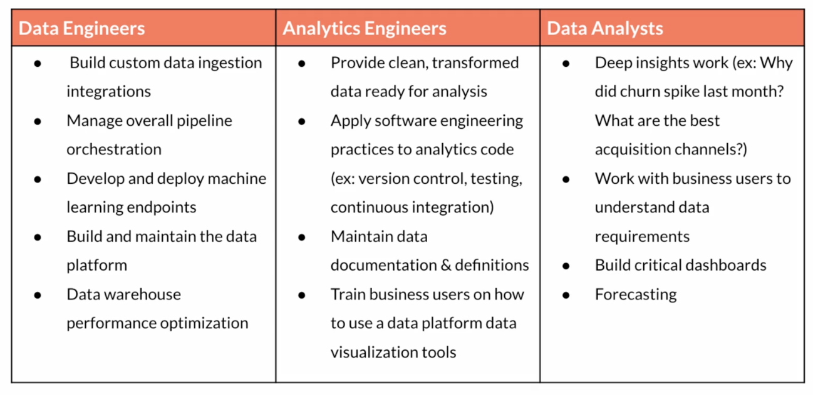

# [dbt fundamentals](https://learn.getdbt.com/courses/dbt-fundamentals)

## 1. Welcome to dbt fundamentals

## 2. Who is an Analytics Engineer

### Traditional Data Teams

A traditional data team typically have 2 roles

- Data engineer: maintaining data infra, building ETL or ELT, orchestrating the data pipeline, using Python, Java, SQL, ... in order to create tables and views.
- Data analyst: being close to business decision makers in finance, marketing and other departments. Consuming the data served by DE. Delivering report, dashboard, excel, ... to stakeholders.

There is a gap between DE and DA:

- DA know what to build (business requirements)
- DE know how to build it (technologies)

### ETL and ELT

ETL (extract transform load) is the process of creating new database objects by extracting data from multiple data sources, transforming it on a local or third party machine, and loading the transformed data into a data warehouse.

Traditional ETL requires additional tools, languages, skills to orchestrate. So, it's typically been handled by DE.

Nowadays, data warehouses combine database and super computer for transforming data and data can be transformed directly in the warehouse - no need to extract before loading repeatedly. So, ELT has been emerged.

ELT (extract load transform) is a more recent process of creating new database objects by first extracting and loading raw data into a data warehouse and then transforming that data directly in the warehouse.

ELT shifts focus to:

- Get the data in the data warehouse (DE will be in charge of it)
- Transform the data from there (Analyst Engineer can be in charge of it)

With the cloud revolution, cloud-based data warehouses offer:

- Scalable compute
- Scalable storage
- Reduction of transfer time
  => It makes the transition from ETL to ELT possible.

### Analytics Engineer

Analytics engineers focus on the transformation of raw data into transformed data that is ready for analysis. This new role on the data team changes the responsibilities of data engineers and data analysts.

Data engineers can focus on larger data architecture and the EL in ELT.

Data analysts can focus on insight and dashboard work using the transformed data.

Note: At a small company, a data team of one may own all three of these roles and responsibilities. As your team grows, the lines between these roles will remain blurry.

A modern data team:

- Data Engineer
- Analytics Engineer
- Data Analyst

### The Modern Data Stack and dbt

dbt empowers data teams to leverage software engineering principles for transforming data.

## 3. Set Up dbt Cloud

## 4. Models

### What are Models?

Models are .sql files that live in the models folder.

Models are simply written as select statements - there is no DDL/DML that needs to be written around this. This allows the developer to focus on the logic.

### Your first dbt model

Pro tips when creating the dbt model: - Try sql queries on data warehouse first, and make sure it works properly. - Then, convert it into dbt models. - Try preview execution by using dbt to validate the results, and there is no table and view built in data warehouse. - Executing `dbt run` will actually materialize the models into the data warehouse.

The default materialization is a view.

When `dbt run` is executing, dbt is wrapping the select statement in the correct DDL/DML to build that model as a table/view. If that model already exists in the data warehouse, dbt will automatically drop that table or view before building the new database object. \*Note: If you are on BigQuery, you may need to run dbt run --full-refresh for this to take effect.

### Modularity

Modularity is the degree to which a system's components may be separated and recombined, often with the benefit of flexibility and variety in use. Modularity allows us to reuse models and not repeat the logical logic.

### ref macro

Models can be written to reference the underlying tables and views that were building the data warehouse (e.g. analytics.dbt_jsmith.stg_jaffle_shop_customers). This hard codes the table names and makes it difficult to share code between developers.

The `ref` function allows us to build dependencies between models in a flexible way that can be shared in a common code base. The ref function compiles to the name of the database object as it has been created on the most recent execution of dbt run in the _particular development environment_. This is determined by the environment configuration that was set up when the project was created.

The `ref` function also builds a lineage graph and allow dbt to determine dependencies between models and takes those into account to build models in the correct order.

### Model history

There have been multiple modeling paradigms since the advent of database technology. Many of these are classified as normalized modeling.

Normalized modeling techniques were designed when storage was expensive and computational power was not as affordable as it is today.

With a modern cloud-based data warehouse, we can approach analytics differently in an agile or ad hoc modeling technique. This is often referred to as denormalized modeling.

dbt can build your data warehouse into any of these schemas. dbt is a tool for how to build these rather than enforcing what to build.

### Naming convention

In working on this project, we established some conventions for naming our models.

- **Sources** (src) refer to the raw table data that have been built in the warehouse through a loading process. (We will cover configuring Sources in the Sources module)
- **Staging** (stg) refers to models that are built directly on top of sources. These have a one-to-one relationship with sources tables. These are used for very light transformations that shape the data into what you want it to be. These models are used to clean and standardize the data before transforming data downstream. Note: These are typically materialized as views.
- **Intermediate** (int) refers to any models that exist between final fact and dimension tables. These should be built on staging models rather than directly on sources to leverage the data cleaning that was done in staging.
- **Fact** (fct) refers to any data that represents something that occurred or is occurring. Examples include sessions, transactions, orders, stories, votes. These are typically skinny, long tables.
- **Dimension** (dim) refers to data that represents a person, place or thing. Examples include customers, products, candidates, buildings, employees.
  Note: The Fact and Dimension convention is based on previous normalized modeling techniques.

### Reorganize project

**Marts** folder: All intermediate, fact, and dimension models can be stored here. Further subfolders can be used to separate data by business function (e.g. marketing, finance)

**Staging** folder: All staging models and source configurations can be stored here. Further subfolders can be used to separate data by data source (e.g. Stripe, Segment, Salesforce). (We will cover configuring Sources in the Sources module)

## 5. Sources

### Sources

Sources represent the raw data that is loaded into the data warehouse.

We can reference tables in our models with an explicit table name (raw.jaffle_shop.customers). However, setting up `Sources` in dbt and referring to them with the source function enables a few important tools.

- Multiple tables from a single source can be configured in one place.

- Sources are easily identified as green nodes in the Lineage Graph.

- You can use dbt source freshness to check the freshness of raw tables.

### Configuring sources

Sources are configured in YML files in the models directory.

View the full documentation for configuring sources on the [source properties](https://docs.getdbt.com/reference/source-properties) page of the docs.

### Source function

The `ref` function is used to build dependencies between models.

Similarly, the `source` function is used to build the dependency of one model to a source. The Lineage Graph will represent the sources in green.

### Source freshness

Freshness thresholds can be set in the YML file where sources are configured. For each table, the keys `loaded_at_field` and `freshness` must be configured.

A threshold can be configured for giving a warning and an error with the keys `warn_after` and `error_after`.

The freshness of sources can then be determined with the command `dbt source freshness`.

## 6. Tests

### Testing

Testing is used in software engineering to make sure that the code does what we expect it to.

In Analytics Engineering, testing allows us to make sure that the SQL transformations we write produce a model that meets our assertions.

In dbt, tests are written as select statements. These select statements are run against your materialized models to ensure they meet your assertions.

### Tests in dbt

In dbt, there are two types of tests - generic tests and singular tests:

- Generic tests are a way to validate your data models and ensure data quality. These tests are predefined and can be applied to any column of your data models to check for common data issues. They are written in YAML files.
- Singular tests are data tests defined by writing specific SQL queries that return records which fail the test conditions. These tests are referred to as "singular" because they are one-off assertions that are uniquely designed for a single purpose or specific scenario within the data models.

dbt ships with four built in tests: unique, not null, accepted values, relationships.

- Unique tests to see if every value in a column is unique
- Not_null tests to see if every value in a column is not null
- Accepted_values tests to make sure every value in a column is equal to a value in a provided list
- Relationships tests to ensure that every value in a column exists in a column in another model (see: referential integrity)

Tests can be run against your current project using a range of commands:

- dbt test runs all tests in the dbt project
- dbt test --select test_type:generic
- dbt test --select test_type:singular
- dbt test --select one_specific_model

Read more here in [testing documentation](https://docs.getdbt.com/reference/node-selection/test-selection-examples).

## 7. Documentation

### Documentation

Documentation is essential for an analytics team to work effectively and efficiently. Strong documentation empowers users to self-service questions about data and enables new team members to on-board quickly.

Documentation often lags behind the code it is meant to describe. This can happen because documentation is a separate process from the coding itself that lives in another tool.

Therefore, documentation should be as automated as possible and happen as close as possible to the coding.

In dbt, models are built in SQL files. These models are documented in YML files that live in the same folder as the models.

### Writing documentation and doc blocks

Documentation of models occurs in the YML files (where generic tests also live) inside the models directory. It is helpful to store the YML file in the same subfolder as the models you are documenting.

For models, descriptions can happen at the model, source, or column level.

If a longer form, more styled version of text would provide a strong description, doc blocks can be used to render markdown in the generated documentation.

### Generating and viewing documentation

In the command line section, an updated version of documentation can be generated through the command dbt docs generate. This will refresh the `view docs` link in the top left corner of the Cloud IDE.

The generated documentation includes the following:

- Lineage Graph
- Model, source, and column descriptions
- Generic tests added to a column
- The underlying SQL code for each model
- and more...

## 8. Deployment
Development vs. Deployment
Development in dbt is the process of building, refactoring, and organizing different files in your dbt project. This is done in a development environment using a development schema (dbt_jsmith) and typically on a non-default branch (i.e. feature/customers-model, fix/date-spine-issue). After making the appropriate changes, the development branch is merged to main/master so that those changes can be used in deployment.
Deployment in dbt (or running dbt in production) is the process of running dbt on a schedule in a deployment environment. The deployment environment will typically run from the default branch (i.e., main, master) and use a dedicated deployment schema (e.g., dbt_prod). The models built in deployment are then used to power dashboards, reporting, and other key business decision-making processes.
The use of development environments and branches makes it possible to continue to build your dbt project without affecting the models, tests, and documentation that are running in production.
Creating your Deployment Environment
A deployment environment can be configured in dbt Cloud on the Environments page.
General Settings: You can configure which dbt version you want to use and you have the option to specify a branch other than the default branch.
Data Warehouse Connection: You can set data warehouse specific configurations here. For example, you may choose to use a dedicated warehouse for your production runs in Snowflake.
Deployment Credentials:Here is where you enter the credentials dbt will use to access your data warehouse:
IMPORTANT: When deploying a real dbt Project, you should set up a separate data warehouse account for this run. This should not be the same account that you personally use in development.
IMPORTANT: The schema used in production should be different from anyone's development schema.
Scheduling a job in dbt Cloud
Scheduling of future jobs can be configured in dbt Cloud on the Jobs page.
You can select the deployment environment that you created before or a different environment if needed.
Commands: A single job can run multiple dbt commands. For example, you can run dbt run and dbt test back to back on a schedule. You don't need to configure these as separate jobs.
Triggers: This section is where the schedule can be set for the particular job.
After a job has been created, you can manually start the job by selecting Run Now
Reviewing Cloud Jobs
The results of a particular job run can be reviewed as the job completes and over time.
The logs for each command can be reviewed.
If documentation was generated, this can be viewed.
If dbt source freshness was run, the results can also be viewed at the end of a job.
