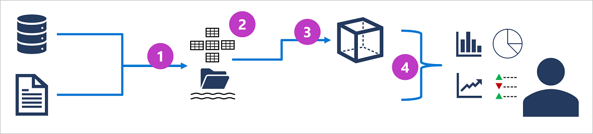

# Explore core data concepts

## Introduction

- Over the last few decades, the amount of data generated by systems, applications, and devices has increased significantly. Data is everywhere, in a multitude of structures and formats.
- Data is a valuable asset that provides a wealth of useful information and informs critical business decisions.

## Identify data formats

- Data is a collection of facts such as numbers, descriptions, and observations used to record information.
- Data structures is the way that we organized data. It often represents entities that are important to organization (such as customers, products, ...). Each entity has one or more attributes, or characteristics.

### Structured data

- **Structured** data is data that adheres to a _fixed schema_, so all of the data has the same fields or properties.
- Most common _schema_ for structured data entities is tabular.

### Semi-structured data

- **Semi-structure** data is information that has some structure, but which allows for some variation between entity instances.
- One common format for semi-structured data is _JSON_

### Unstructured data

- **Unstructured data** is data that doesn't have specific structure. For example: documents, images, audio, video and binary files.

## Explore file storage

- In most organizations, important data files are stored centrally in some kind of shared file storage system. Increasingly, that central storage location is hosted in the cloud, enabling cost-effective, secure, and reliable storage for large volumes of data.

### Common file formats

| Format | Description                                                                     |
| ------ | ------------------------------------------------------------------------------- |
| CSV    | Human-readable format. Good choice for structured data                          |
| JSON   | Human-readable format. Good choice for both structured and semi-structured data |
| XML    | Human-readable format. Good choice for both structured and semi-structured data |
| BLOB   | Good choice for unstructured data: image, video, audio, ...                     |

### Optimized file formats

- While human-readable formats for structured and semi-structured data can be useful, they're typically not optimized for storage space or processing

| Format  | Description                                                                                                                                                 |
| ------- | ----------------------------------------------------------------------------------------------------------------------------------------------------------- |
| Arvo    | A row-based format. A good format for compressing data and minimizing storage and network bandwidth requirements                                            |
| ORC     | A columnar format. Optimizing for reading and writing in Apache Hive                                                                                        |
| Parquet | A columnar format. Parquet specializes in storing and processing nested data types efficiently. It supports very efficient compression and encoding schemes |

## Explore databases

### Relational databases

- Relational databases are commonly used to store and query structured data. The data is stored in tables.

### Non-relational databases

- Non-relational databases are data management systems that don’t apply a relational schema to the data.

| NoSQL database         | Description                                                                                                                               |
| ---------------------- | ----------------------------------------------------------------------------------------------------------------------------------------- |
| Key-value databases    | Each record consists of a unique key and an associated value, which can be in any format                                                  |
| Document databases     | A specific form of key-value database in which the value is a JSON document                                                               |
| Column family database | A database stores tabular data comprising rows and columns. Each column family holds a set of columns that are logically related together |
| Graph database         | A database stores data in form of nodes and relationships between nodes                                                                   |

## Explore transactional data processing

- A transactional system records _transactions_ that encapsulate specific events that the organization wants to track. Transaction could be financial, such as movement of money between accounts in a bank system, or it might be part of a retail system, tracking payments for goods and services from customers. Think of transaction as a small, discrete, unit of work.
- Transactional systems are often high-volume, sometimes handling many millions of transactions in a single day. The data being processed has to be accessible very quickly.
- OLTP (Online Transactional Processing) solutions rely on a database in which data storage is optimized for both read and write operations in order to support CRUD operations.
- OLTP systems enforce transactions following ACID semantics to ensure data integrity:
  - **Atomic**: each transaction is treated as a single unit, which succeeds completely or fails completely.
  - **Consistency**: transactions can only take the data in the database from one valid state to another.
  - **Isolation**: concurrent transactions cannot interfere with one another, and must result in a consistent database state.
  - **Durability**: when a transaction has been committed, it will remain committed.

## Explore analytical data processing

- Analytical data processing typically uses read-only (or read-mostly) systems that store vast volumes of historical data or business metrics.

- The specific details for an analytical processing system can vary between solutions, but a common architecture for enterprise-scale analytics looks like this:
  

  1. Operational data is extracted, transformed, and loaded (ETL) into a data lake for analysis.

  2. Data is loaded into a schema of tables - typically in a Spark-based data lakehouse with tabular abstractions over files in the data lake, or a data warehouse with a fully relational SQL engine.

  3. Data in the data warehouse may be aggregated and loaded into an online analytical processing (OLAP) model, or cube. Aggregated numeric values (measures) from fact tables are calculated for intersections of dimensions from dimension tables. For example, sales revenue might be totaled by date, customer, and product.

  4. The data in the data lake, data warehouse, and analytical model can be queried to produce reports, visualizations, and dashboards.

- _Data warehouses_ are an established way to store data in a relational schema that is optimized for read operations – primarily queries to support reporting and data visualization.

- _Data Lakehouses_ are a more recent innovation that combine the flexible and scalable storage of a data lake with the relational querying semantics of a data warehouse.

- An OLAP model is an aggregated type of data storage that is optimized for analytical workloads. Because OLAP data is pre-aggregated, queries to return the summaries it contains can be run quickly.

# Explore data roles and services

## Explore job roles in the world of data

- The three key job roles that deal with data in most organizations are:

  - Database administrators manage databases, assigning permissions to users, storing backup copies of data and restore data in the event of a failure.

  - Data engineers manage infrastructure and processes for data integration across the organization, applying data cleaning routines, identifying data governance rules, and implementing pipelines to transfer and transform data between systems.

  - Data analysts explore and analyze data to create visualizations and charts that enable organizations to make informed decisions.

## [Identify data services](https://learn.microsoft.com/en-us/training/modules/explore-roles-responsibilities-world-of-data/3-data-services)
