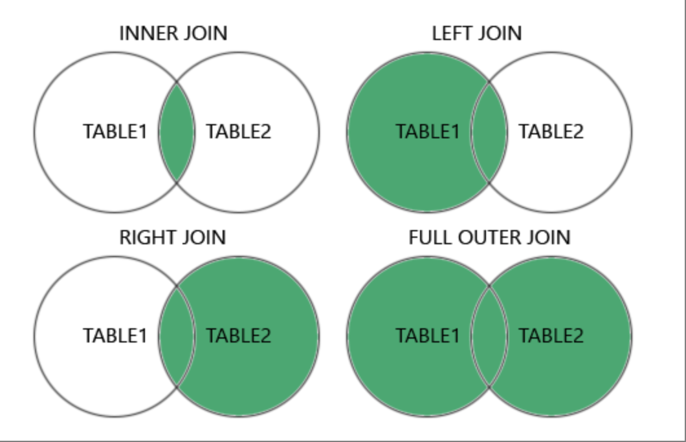

# Learn SQL with SQLBolt

## Introduction to SQL

### What is SQL?

- SQL, or Structured Query Language is a language designed to query, manipulate and transform data from a relational database.

### Relational databases

- A relational database represents a collection of related (two-dimensional) tables. A table has a fixed number of named columns (attributes or properties of the table), and any number of row (item) of data.
- You can think of a table as a type of _entity_, each row as a _instance_ of that _entity_ and columns as the common properties shared by all _instances_ of that _entity_.

## Lesson 1: SELECT queries 101

- A query in itself is just a statement which declares what data we are looking for, where to find it in the database, and optionally, how to transform it before it is returned.

```sql
SELECT column, another_column, …-- Which columns should be select
FROM mytable; -- From which table
```

## Lesson 2 and 3: Query with constrains

```sql
SELECT column, another_column, …
FROM mytable
WHERE condition -- Return only rows satisfied the condition
    AND/OR another_condition
    AND/OR …;
```

- Writing clauses to constrain the set of rows returned also allows the query to run faster due to the reduction in unnecessary data being returned
- SQL provides some useful operator for many different type, such as: numerical operator (>, <, <=, ...), string comparison (=, !=, LIKE, %, ...), OR, AND, ...

## Lesson 4: Filtering and sorting Query results

- Even though the data in a database may be unique, the results of any particular query may not be (eg: Many different movies have the same released year, ...). `DISTINCT` keyword helps discard rows that have duplicate column.

```sql
SELECT DISTINCT column, another_column, …
FROM mytable
WHERE condition(s);
```

- Sort results by a given column in ascending or descending alpha-numerical order

```sql
SELECT column, another_column, …
FROM mytable
WHERE condition(s)
ORDER BY column ASC/DESC;
```

- The `LIMIT` will reduce the number of rows to return, and the optional `OFFSET` will specify where to begin counting the number rows from

```sql
SELECT column, another_column, …
FROM mytable
WHERE condition(s)
ORDER BY column ASC/DESC
LIMIT num_limit OFFSET num_offset;
```

## Lesson 6: Multi-table queries with JOINs

### Database normalization

- Database normalization is useful because it minimizes duplicate data in any single table, and allows for data in the database to grow independently of each other (ie. Types of car engines can grow independent of each type of car). As a trade-off, queries get slightly more complex since they have to be able to find data from different parts of the database, and performance issues can arise when working with many large tables.

### Multi-table queries with JOINs

- The `JOIN` combines row data across two separate tables based on a related column between them

```sql
SELECT column, another_table_column, …
FROM mytable
INNER JOIN another_table
    ON mytable.id = another_table.id
WHERE condition(s)
ORDER BY column, … ASC/DESC
LIMIT num_limit OFFSET num_offset;
```

- After the tables are joined, the other clauses will be applied

## Lesson 7: OUTER JOINs

- (INNER) JOIN: Returns records that have matching values in both tables
- LEFT (OUTER) JOIN: Returns all records from the left table, and the matched records from the right table
- RIGHT (OUTER) JOIN: Returns all records from the right table, and the matched records from the left table
- FULL (OUTER) JOIN: Returns all records when there is a match in either left or right table



## Lesson 8: A short note on NULLs

- It's always good to reduce the possibility of `NULL` values in databases because they require special attention when constructing queries, constraints (certain functions behave differently with null values) and when processing the results.
- An alternative to `NULL` values in your database is to have data-type appropriate default values, like 0 for numerical data, empty strings for text data, etc. But if your database needs to store incomplete data, then `NULL` values can be appropriate if the default values will skew later analysis (for example, when taking averages of numerical data)

```sql
SELECT column, another_column, …
FROM mytable
WHERE column IS/IS NOT NULL
AND/OR another_condition
AND/OR …;
```

## Lesson 9: Queries with expressions

- `Expression` helps us write more complex logic and transform column values in a query.

```sql
SELECT particle_speed / 2.0 AS half_particle_speed
FROM physics_data
WHERE ABS(particle_position) * 10.0 > 500;
```

- `AS` keyword is to give a descriptive alias and helps query more readable.

```sql
SELECT col_expression AS expr_description, …
FROM mytable;
```

```sql
SELECT column AS better_column_name, …
FROM a_long_widgets_table_name AS mywidgets
INNER JOIN widget_sales
  ON mywidgets.id = widget_sales.widget_id
```

## Lesson 10 and 11: Queries with aggregates

- SQL also supports the use of aggregate expressions (or functions) that allow you to summarize information about a group of rows of data. Without a specified grouping, each aggregate function is going to run on the whole set of result row and return a single value

### Common aggregate functions

| Function      | Description                                                                             |
| ------------- | --------------------------------------------------------------------------------------- |
| COUNT(\*)     | Counts the number of rows in the group if no column name is specified                   |
| COUNT(column) | Counts the number of rows in the group with non-NULL values in the specified column     |
| MIN(column)   | Finds the smallest numerical value in the specified column for all rows in the group    |
| MAX(column)   | Finds the largest numerical value in the specified column for all rows in the group     |
| AVG(column)   | Finds the average numerical value in the specified column for all rows in the group     |
| SUM(column)   | Finds the sum of all numerical values in the specified column for the rows in the group |

### Grouped aggregate functions

```sql
SELECT AGG_FUNC(column_or_expression) AS aggregate_description, …
FROM mytable
WHERE constraint_expression
GROUP BY column;
```

### Filter grouped row from the result

```sql
SELECT group_by_column, AGG_FUNC(column_expression) AS aggregate_result_alias, …
FROM mytable
WHERE condition
GROUP BY column
HAVING group_condition;
```

## Lesson 12: Order of execution of a Query

1. `FROM` and `JOINs`
2. `WHERE`
3. `GROUP BY`
4. `HAVING`
5. `SELECT`
6. `DISTINCT`
7. `ORDER BY`
8. `LIMIT / OFFSET`

## Lesson 13: Inserting rows

### What is a Schema?

- _database schema_ is what describes the structure of each table, constraints, and the data types of each column.

### Inserting new data

- Each row of data should contains all values for every corresponding column in the table.

```sql
INSERT INTO mytable
VALUES (value_or_expr, another_value_or_expr, …),
       (value_or_expr_2, another_value_or_expr_2, …),
       …;
```

- In some cases, if we have incomplete data and the table contains columns that support default values, you can insert rows with only the columns of data you have by specifying them explicitly

```sql
INSERT INTO mytable
(column, another_column, …)
VALUES (value_or_expr, another_value_or_expr, …),
      (value_or_expr_2, another_value_or_expr_2, …),
      …;
```

-In addition, we can use mathematical and string expressions with the values that you are inserting

```sql
INSERT INTO boxoffice
(movie_id, rating, sales_in_millions)
VALUES (1, 9.9, 283742034 / 1000000);
```

## Lesson 14: Updating rows

```sql
UPDATE mytable
SET column = value_or_expr,
    other_column = another_value_or_expr,
    …
WHERE condition;
```

### Taking care

- Most people working with SQL will make mistakes updating data at one point or another. Whether it's updating the wrong set of rows in a production database, or accidentally leaving out the WHERE clause (which causes the update to apply to all rows), you need to be extra careful when constructing UPDATE statements.

- One helpful tip is to always write the constraint first and test it in a SELECT query to make sure you are updating the right rows, and only then writing the column/value pairs to update.

## Lesson 15: Deleting rows

```sql
DELETE FROM mytable
WHERE condition;
```

### Taking extra care

- Like the UPDATE statement from last lesson, it's recommended that you run the constraint in a SELECT query first to ensure that you are removing the right rows. Without a proper backup or test database, it is downright easy to irrevocably remove data, so always read your DELETE statements twice and execute once.

## Lesson 16: Creating tables

```sql
CREATE TABLE IF NOT EXISTS mytable (
    column DataType TableConstraint DEFAULT default_value,
    another_column DataType TableConstraint DEFAULT default_value,
    …
);
```

- If there already exists a table with the same name, the SQL implementation will usually throw an error, so to suppress the error and skip creating a table if one exists, we can use the IF NOT EXISTS clause.

### Table constraints

- Some constraints that should remember

| Function    | Description                                                                                                                        |
| ----------- | ---------------------------------------------------------------------------------------------------------------------------------- |
| PRIMARY KEY | This means that the values in this column are unique, and each value can be used to identify a single row in this table            |
| FOREIGN KEY | This is a consistency check which ensures that each value in this column corresponds to another value in a column in another table |

## Lesson 17: Altering tables

As your data changes over time, SQL provides a way for you to update your corresponding tables and database schemas by using the ALTER TABLE statement to add, remove, or modify columns and table constraints.

- Adding columns

```sql
ALTER TABLE mytable
ADD column DataType OptionalTableConstraint
    DEFAULT default_value;
```

- Removing columns

```sql
ALTER TABLE mytable
DROP column_to_be_deleted;
```

- Renaming the table

```sql
ALTER TABLE mytable
RENAME TO new_table_name;
```

## Lesson 18: Dropping tables

```sql
DROP TABLE IF EXISTS mytable;
```

- if we have another table that is dependent on columns in table you are removing (for example, with a FOREIGN KEY dependency) then you will have to either update all dependent tables first to remove the dependent rows or to remove those tables entirely.
