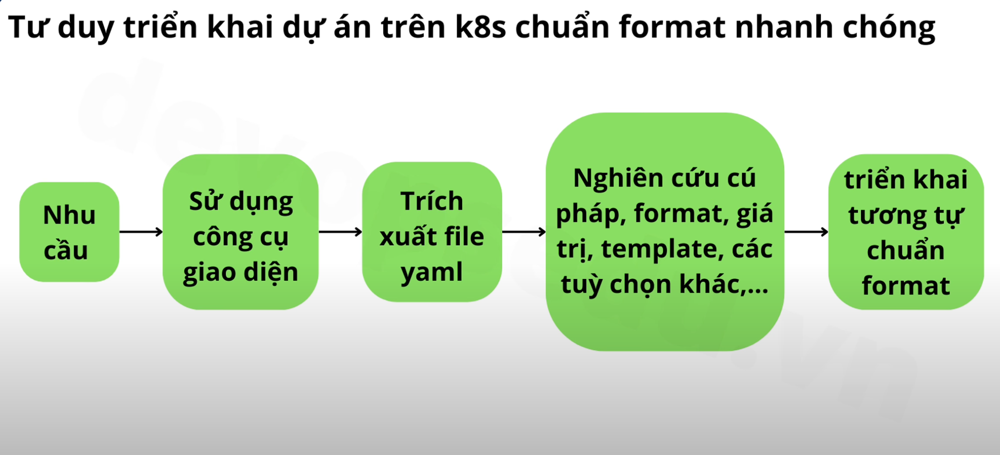

# K8s application deployment

## 7. Quy trình triển khai dự án trên k8s

Keyword: **kubernetes flow**

## 8. File yaml Kubernetes

### Tại sao K8s sử dụng yaml

- Cú pháp đơn giản (Dẽ đọc, dễ hiểu)
- Định dạng phong phú (number, string, list, ...)
- Cấu trúc rõ ràng
- Cộng đồng lớn

=> K8s thường sử dụng `yaml` để cấu hình, mặc dù có hỗ trợ cả `json`.

### Syntax

- `apiVersion`
- `kind`: syntax để khai báo tài nguyên.
- `metadata`: chứa thông tin liên quan đến tài nguyên.
- `spec`: định nghĩa chi tiết cấu hình cụ thể của tài nguyên.

## 9. Namespace kubernetes

### Namespace là gì?

Trong k8s, Namespace là một cách tổ chức và phân tách các tài nguyên trong một cụm Kubernetes để quản lý tốt hơn. Nó được sử dụng để chia nhỏ tài nguyên của một cụm lớn thành các không gian làm việc logic nhỏ hơn, giúp dễ dàng quản lý và vận hành hơn.

Ví dụ:

- Namespace cho dự án A, dự án B trên cùng một k8s cluster
- Namespace cho môi trường dev, stagin và production trên cùng một cụm k8s.

### Namespace để làm gì?

Trong k8s, Namespace giúp giúp quản lý và phân chia các tài nguyên một cách dễ dàng hơn khi có nhiều dự án

- Kiểm soát lượng tài nguyên: CPU, RAM, ... cho từng dự án.
- Dễ dàng thực thi chính sách bảo mật, kiểm soát quyền truy cập.

#### Thao tác Namespace bằng command line

```bash
# Get all pods in the default namespace
kubectl get pod --namespace default

# Get all namespaces
kubectl get ns

# Create a new namespace
kubectl create ns project-1

# Delete an existing namespace
kubectl delete ns project-1
```

#### Cấu hình Namespace với file yaml

```yaml
# ns.yaml
apiVersion: v1
kind: Namespace
metadata:
  name: project-1
```

```bash
# Apply yaml
kubectl apply -f ns.yaml

# Delete
kubectl delete -f ns.yaml
```
Quản lý k8s bằng yaml dễ dàng quản lý, khởi tạo tài nguyên, cũng như dễ dàng khôi phục cấu hình khi có lỗi xảy ra

#### Giới hạn tài nguyên Namespace sử dụng
```yaml
# resourcequota.yaml
apiVersion: v1
kind: ResourceQuota
metadata:
  name: mem-cpu-quota
  namespace: project-1
spec:
  hard:
    requests.cpu: "2"
    requests.memory: 4Gi
```
```bash
kubectl apply -f resourcequota.yaml
```

## 10. Phương pháp triển khai dự án trên K8s hiệu quả

- Sử dụng công cụ quản lý Kubernetes bằng giao diện và tạo các tài nguyên rồi export các file yaml ra và nghiên cứu các file yaml đó với chuẩn format.

## 11. Các công cụ quản lý k8s
Các loại công cụ quản lý k8s:
- command app (e.g: k9s)
- desktop app (e.g: lens)
- website app (e.g: rancher)

Rancher là công cụ được instructor sử dụng trong thực tế nhiều nhất

## 12. Cài đặt Rancher và quản lý K8s
### Rancher là gì?
Rancher là một công cụ giúp triển khai, quản lý và giám sát nhiều cụm Kubernetes trên các môi trường khác nhau, bao gồm cả On-premise và trên các nhà cung cấp dịch vụ cloud: AWS, GCP, ...

Rancher chạy như web service, nên cần một server để triển khai.

### Rancher làm được gì?
- Quản lý nhiều cụm Kubernetes
- Phân quyên mạnh mẽ (based RBAC Kubernetes)
- Hỗ trợ giám sát và cảnh báo cụm Kubernetes
- Bảo mật tốt

### Những cách cài đặt Rancher
- Docker trên On-premise
- Cloud

### Cài đặt Rancher trên On-premise
Xem video và hướng dẫn ở [link](https://devopsedu.vn/courses/khoa-hoc-kubenetes-thuc-te/lesson/bai-12-cai-dat-rancher-va-quan-ly-kubernetes-2/)

**Lưu ý**: Phiên bản của Rancher nên support phiên bản của k8s.

## 13. Cài đặt Rancher trên Cloud
Tạo một server (VM) trên cloud và cài đặt Rencher

Lưu dữ liệu vào `additional storge` để đảm bảo khi server bị hỏng hoặc terminate thì dữ liệu vẫn đảm bảo. Dùng server khác connect vào thì vẫn xem được dữ liệu. `Disk` sẽ vẫn tính phí ngay cả khi đã tắt `instance`, trừ khi huỷ đi `Disk` không dùng nữa.

Địa chỉ public IP miễn phí sẽ thay đổi khi bật tắt VM. Muốn có public static IP thì cần trả phí. Cũng giống như `Disk` public static IP sẽ vẫn tính phí khi tắt `instance`.

## 14. Pod k8s

### Pod là gì
Pods are the smallest deployable units of computing that you can create and manage in Kubernetes.

A Pod (as in a pod of whales or pea pod) is a group of one or more containers, with shared storage and network resources, and a specification for how to run the containers.

Pod không hẳn được xem như 1 server dù có IP riêng và chứa các container. Hãy xem Pod như là môi trường chia sẻ hay máy chủ ứng dụng

### Sử dụng Pod
#### Truy cập vào container trong `car-serv` pod
```bash
kubectl exec -it car-serv -n car-serv -- bin/bash
```
**Lưu ý**: Khuyến nghị chỉ nên triển khai 1 container trên 1 pod để đảm bảo tính tường minh của ứng dụng, và giảm thiệu sự phụ thuộc khi ứng dụng này lỗi sẽ không ảnh hưởng các ứng dụng khác. Ví dụ triển khai cả front-end và back-end trên 1 pod, khi lỗi thì lỗi cả 2.

## 15. Deployment K8s
### Deployment là gì?
[Document](https://kubernetes.io/docs/concepts/workloads/controllers/deployment/)
- Giúp rollback dễ dàng vì Deployment quản lý phiên bản ứng dụng (lịch sử thay đổi của docker image).
- Giúp scaling bằng cách tăng số lượng pod.
- Tự động khôi phục lỗi, khởi tạo lại pod bị lỗi.

### Sử dụng Deployment trên Rancher
`Redeploy` sử dụng khi có những vấn đề gì đó cần phải khởi động lại.

### Sử dụng Deployment template
- Tải `yaml` từ Rancher
- Một vài trường có giá trị default hoặc không cần thiết thì có thể xoá đi.

## 16. Các command Deployment Kubernetes
[Document](https://kubernetes.io/docs/concepts/workloads/controllers/deployment/)
