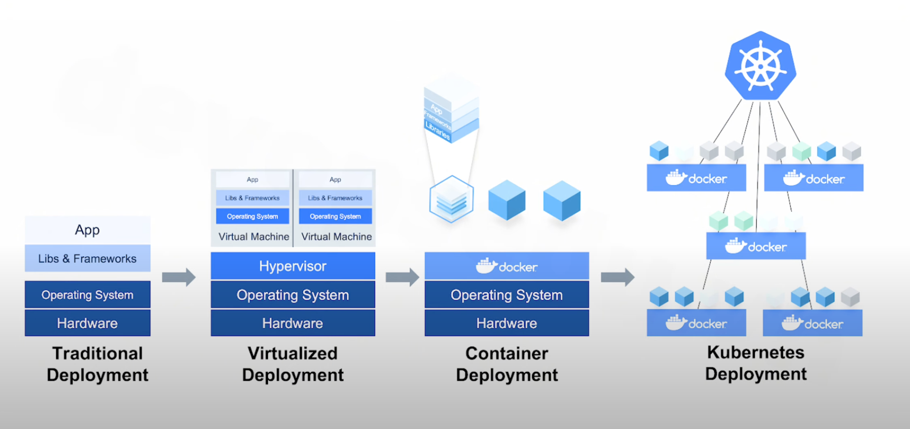

# Mở đầu với Kubernetes

## 1. Kubernetes là gì? Kubernetes để làm gì?

### 1.1 Kubernetes là gì?

Kubernetes, also known as K8s, is an open source system for automating deployment, scaling, and management of containerized application.

### 1.2 Các mô hình triển khai dự án

#### Traditional deployment

- Chạy dự án trực tiếp trên hạ tầng của máy chủ vật lý.
- Việc phân bổ tài nguyên cho các dự án rất phức tạp => Khi một dự án chiếm hết tài nguyên sẽ dẫn đến các dự án khác hoạt động kém hiệu quả hơn.
- Giải pháp khắc phục: chạy mỗi dự án trên một máy chủ khác nhau. Tuy nhiên, duy trì nhiều máy chủ sẽ khó khăn và tốn kém.

#### Virtualized deployment

- Một máy chủ vật lý có thể cài đặt nhiều môi trường ảo hoá (máy chủ áo khác nhau).
- Nhược điểm là tiêu tốn tài nguyên và khó tinh chỉnh cấu hình.

#### Container Deployment

- Đóng gói các dự án thành các môi trường (container) riêng biệt và cấp tài nguyên cần thiết cho từng container.
- Khi một dự án bị thiếu tài nguyên thì chỉ lỗi mỗi mình dự án đó thôi.

### 1.3 Kubernetes để làm gì?

- Khi chưa có kubernetes các quá trình: backup, sửa lỗi, tăng giảm tài nguyên khi traffic tăng cao, quản lý giá trị quan trọng, ... cần được thực hiện thủ công => Error-prone do sai sót trong quá trình thực hiện.
- Kubernestes sẽ giúp tự động hoá các quá trình kể trên.

## 2. Khi nào nên sử dụng Kubernestes

- K8s được các công ty big-tech sử dụng rộng rãi ở trên thế giới và cả VN. Tuy nhiên, có sử dụng K8s hay không cần phải cân nhắc các yếu tố:

  - Hiệu quả
  - Minh bạch
  - Có khả năng vận hành
  - Tối ưu chi phí

- Các dự án phù hợp áp dụng k8s:
  - Dự án lớn, dự án chạy đường dài
  - Dự án có nhu cầu cao về mở rộng
  - Dự án cần triển khai đa môi trường
  - Dự án theo mô hình Microservices
  - Dự án cần khả năng tự phục hồi

## 3. Hạ tầng Kubernetes (Kubernetes architecture)

- `Pod` represents a set of running containers in the cluster
